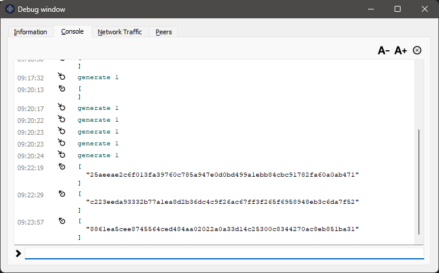
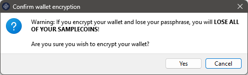
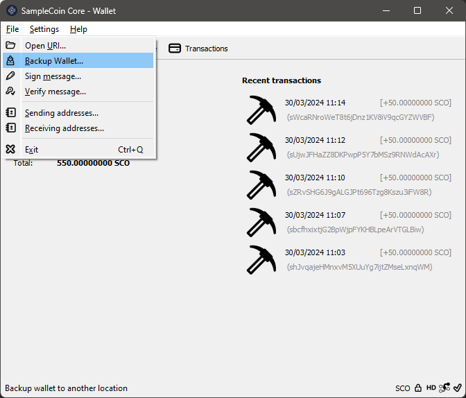

[Português do Brasil](./guide-PT.md) | [English US](./guide-EN.md) | [Español](./guide-ES.md) | [русский](./guide-RU.md) | [简体中文](./guide-ZH.md)

# SampleCoin – Beginner's Guide

Introduction:
=========================================================

In this guide, we present a series of simple steps that anyone, even with no prior experience, can follow to start using their cryptocurrency.

Each coin created by CryptoGera is automatically made available in a public repository at https://git.cryptogera.com. This not only facilitates access to the source code and installation programs but also is crucial to ensure that the code has not been fraudulently manipulated, thus validating the integrity and legitimacy of the coin.

The specific repository for the SampleCoin coin is located at https://git.cryptogera.com/cryptogera/samplecoin.

Here, you will find the source code of the coin, along with binaries - compiled programs ready for installation and use on both Windows and Linux.

Below, we'll show you how to download and install this software, as well as provide an introduction to mining your first coins.

Download and install the coin's wallet
---------------------------------------------------------

To download the wallet, access the "Releases" tab in the coin's repository. For the SampleCoin coin, the address for "Releases" is:

[https://git.cryptogera.com/cryptogera/samplecoin/releases](https://git.cryptogera.com/cryptogera/samplecoin/releases)

On the mentioned page, you will find several zip packages containing the corresponding software.

For Windows users, download the "samplecoin-0.15.1-win64.zip" package. If the 64-bit version does not work on your system, try the 32-bit version, called "samplecoin-0.15.1-win32.zip".

> For Linux users, there is another available package called "samplecoin-0.15.1-linux-x86_64.zip", which requires a little more knowledge to install. If you are using Ubuntu, you can extract this file to the "/" folder of your computer so that the binaries are placed in "/usr/bin".

When you open the zip package, you will see an executable program with the ".exe" extension. This is the wallet installer for Windows. To start the installation, simply double-click on it. A window similar to this will appear:

The installation is similar to any other Windows installation you have performed before. Just follow the steps until the installation is complete. At the end, the SampleCoin coin wallet will be installed:

Running "SampleCoin Core" for the first time
---------------------------------------------------------

Let's open your newly installed wallet. To do this, simply click on the "SampleCoin Core" icon that appears in the menu of your Windows.

The first time you open your wallet, you will see a window similar to this one:

Although it is possible, we do not recommend changing the location (folder) where you will keep your wallet and blockchain data. Click the `OK` button to use the default location.

> If you are a beginner user, choosing a different location to store the data will bring implications that will make it difficult, for example, to create backups. Later in this guide, we will explain how to restore a backup of your wallet. However, if you have changed the folder where you store the wallet data, the instructions will not work.

Next, you will see a window similar to this one below, which shows that your wallet is trying to download blockchain data, that is, trying to synchronize its local database with the database of the SampleCoin coin's data network.

Bitcoin family coins, as is the case with the SampleCoin coin, operate on a distributed and decentralized network. This network is composed of "nodes", which are the wallets themselves interacting with each other. These "nodes" use a shared database among all of them, called the "blockchain".

Your wallet, every time it is opened, tries to connect to the other "nodes" of the network to synchronize blockchain data. This window will stay open and still, unable to synchronize, in two situations:

- When it does not find another "node" on the network, either due to a failed internet connection or because there are no other "nodes" online at the moment;
- When there are no new confirmed transactions, because no one is "mining" new blocks.

Since your coin is new, it is normal for it not to have anything to synchronize, so it will look like this. The first thing you need to do to "bring life" to the SampleCoin coin's blockchain is to mine the first block. See in the next step how to do this.

Mine your first block
---------------------------------------------------------

There are several ways to mine cryptocurrencies. The most common ones are:

- Through commands in the **debug window** of the coin's wallet;
- Through the command line, using the coin's client itself, in this case, the "samplecoin-cli";
- Using mining software in conjunction with an RPC server;
- Using mining software connected to a mining pool;
- Using mining equipment connected to a mining pool.

The first one is the fastest and simplest way, and although it is not efficient for blockchains that have already grown, it works very well for a newly created cryptocurrency.

To mine your first block, open the "SampleCoin Core" wallet you installed on Windows, access the "Help" menu, choose "Debug Window," and activate the "Console" tab:

In the space that appears at the bottom of the Console tab, type `generate 1`:

Press ENTER and wait until a response appears. The waiting time for a response depends on your computer's processing power. You can send the `generate 1` command again before receiving a response, but know that each command sent triggers an additional mining process that requires more resources from your processor and can freeze your wallet. If this happens, you will need to close and reopen the "SampleCoin Core" wallet.

If you receive a response like this, with 2 empty brackets, it means that the block was not generated:

You may need to repeat the `generate 1` command several times until you find a block, which is normal. Just make sure not to send the `generate 1` command excessively to avoid freezing your wallet. Below, an example of several attempts made:

And finally, some successful responses after several attempts of the `generate 1` command. Note that when a block is successfully mined, a sequence of letters and numbers appears between brackets:

The blocks you just mined will appear in your wallet, each as a reward of 50 coins:

But hold on, the reward coins are not yet yours. Each new mined block needs to receive 101 confirmations before being paid. For this, another 101 blocks need to be mined on the blockchain, by you or by other people. When this happens, these coins will automatically become available in your wallet.

> In Linux, the steps would be, first, to start the samplecoind in daemon mode with the command `samplecoind –daemon` and then use the client to generate the block with the command `samplecoin-cli generate 1`.

Protect your wallet with a password
---------------------------------------------------------

A newly installed wallet has no password, which puts your coins at risk if other people have access to your computer.

To create a new password, you need to access the "Settings" menu and choose "Encrypt Wallet":

Then, enter the new password (passphrase) to protect your wallet. The same password needs to be entered in both fields. It is recommended that the password be composed of at least 10 random characters or eight or more words. Take note of the password provided and click `OK` to proceed:

Next, you will see this important warning, which alerts that if you forget your password, ALL COINS IN YOUR WALLET will be lost. If you wish to proceed with securing your wallet, answer "Yes":

Finally, an alert appears that, even encrypted, your wallet is not invulnerable or malware-proof if your computer is infected. It also warns that, if you have made a backup before encrypting your wallet, it will be unprotected and, therefore, must be replaced by a new backup:

Click the `OK` button, and the encryption process will begin. Do not interrupt the process, even if it seems stuck, as shown below:

This blank window will disappear on its own once the process is complete.

Done! Your wallet is encrypted, and from now on, whenever you send coins, you will need to enter this password (passphrase).

> Never forget the password for your wallet. Without it, you will never have access to the coins in your wallet.

In the future, how to change the wallet password?
---------------------------------------------------------

If the wallet is encrypted, in the "Settings" menu, you will see that the option "Encrypt Wallet" appears disabled, and the option "Change passphrase" is enabled. Use this option if you ever want to change your wallet password.

How to make a backup of your wallet
---------------------------------------------------------

In the drop-down menu that appears when clicking on "File," choose the "Backup Wallet..." option.

A dialog box will open for you to select the location where you want to save the backup file. Choose a secure location on your computer or an external storage device.

Give a meaningful name to the backup file, for example, "wallet_backup.dat." Click "Save" to complete the process.

Make sure the backup file has been successfully saved to the desired location.

**IMPORTANT!** It is crucial to store your backup file in a secure and preferably encrypted location, such as an external drive or trusted cloud storage service.

By following these steps, you will have backed up your SampleCoin Core wallet using the "File -> Backup Wallet" option on Windows. Make sure to make new backups regularly to ensure the security of your coins.

How to restore a backup of your wallet
---------------------------------------------------------

> **ALERT!** Never restore old backups on top of current wallets. When restoring a backup of your wallet, any transactions or balances made after this backup will be lost because the backup will overwrite the current state of your wallet with the state at the time the backup was made. Therefore, it is important to make backups regularly and maintain good security practices to protect your coins.

### Step 1: Close "SampleCoin Core"

If "SampleCoin Core" is open, close it completely before proceeding with the wallet restoration.

### Step 2: Locate the backup file

Make sure you have access to the backup file of your wallet. This will usually be a file with the extension ".dat" that you saved previously.

### Step 3: Access the "SampleCoin Core" data folder

Open Windows File Explorer.

Navigate to `%appdata%\samplecoin`. You can simply copy and paste `%appdata%\samplecoin` into the address bar of File Explorer and press Enter to quickly access this folder.

### Step 4: Backup your existing wallet (optional)

Before proceeding with the restoration, it is good practice to back up your existing wallet in case there is any important information you do not want to lose.

### Step 5: Replace the existing wallet file with the backup

In the `%appdata%\samplecoin` directory, find the existing wallet file, which usually has the name "wallet.dat."

Rename "wallet.dat" to "wallet-previous.dat" or copy this file to another folder as a precaution.

Copy the backup file of your wallet to the `%appdata%\samplecoin` directory and rename it to "wallet.dat."

### Step 6: Start "SampleCoin Core"

After replacing the wallet file, start "SampleCoin Core" again.

### Step 7: Verify the restoration was successful

Once "SampleCoin Core" is open, verify that your wallet has been restored correctly. Check the balance and transactions to ensure everything is as expected.

Sending and Receiving Coins
---------------------------------------------------------

"SampleCoin Core" offers a wide range of features to securely send and receive coins. Follow this step-by-step guide to learn how to use these functionalities:

### Sending Coins:

1. **Open "SampleCoin Core":**
   - Launch the "SampleCoin Core" application on your computer.

2. **Access your Wallet:**
   - After opening "SampleCoin Core," wait for your wallet to load. You will need to enter your password, if any, to unlock your wallet.

3. **Select "Send":**
   - In the main menu, click on "Send" or find the send option in the navigation bar.

4. **Fill in Transaction Details:**
   - Enter the "SampleCoin" address of the recipient in the designated field.
   - Specify the amount you want to send in SampleCoin.
   - Add a transaction fee if desired. A higher fee usually results in faster transaction confirmation.

5. **Review and Confirm:**
   - Before sending the transaction, carefully review the details, such as the destination address and amount.
   - Confirm the transaction and wait for confirmation on the blockchain.

### Receiving Coins:

1. **Get your "SampleCoin" Address:**
   - In "SampleCoin Core," go to the "Receive" section or find the "SampleCoin" address in your wallet.
   - Copy the provided "SampleCoin" address.

2. **Share your Address:**
   - Paste the "SampleCoin" address in an email, message, or payment platform for the sender to send coins to you.

3. **Verify Receipt:**
   - Wait for the sender to send the coins to your address.
   - Once the coins are received, they will appear in your "SampleCoin Core" wallet.

4. **Blockchain Confirmation:**
   - The transaction will be recorded on the blockchain, and after a few confirmations, the coins will be considered fully received and available for use.

Always remember to keep your private key secure and regularly back up your "SampleCoin Core" wallet to ensure the safety of your coins.

Final Recommendations
---------------------------------------------------------

- **Register an Internet domain for your coin:**
  - Ensure a solid online presence by registering a dedicated domain for your coin. This makes it easier to create an official website and provides a central point for information and communication with the community.

- **Register your coin's brand:**
  - Protect the identity and reputation of your coin by registering its brand. This helps avoid potential legal conflicts and promotes trust among users and investors.

- **Promote your coin in all possible venues:**
  - Utilize social media, related forums, blogs, and other channels to promote your coin. The more people who know about your coin, the greater its adoption and appreciation.

- **Mine and encourage mining as much as possible:**
  - Mining is essential for the security and decentralization of your coin. Encourage miners by offering fair rewards and promoting mining within your community.

- **Launch a blockchain explorer:**
  - A blockchain explorer allows users to view transactions, account balances, and other important information about your coin. Make an explorer available to increase transparency and trust in your coin.

- **Develop a wallet app for your coin:**
  - Facilitate access and use of your coin by developing a mobile wallet for iOS and Android devices. This allows users to manage their coins conveniently and securely.

- **Include your coin in mining pools:**
  - Mining pools are groups of miners that combine their processing power to increase the chances of finding blocks and receiving rewards. List your coin in different pools to attract more miners.

- **List your coin on aggregators and exchanges:**
  - Make your coin accessible for buying, selling, and trading by listing it on cryptocurrency exchange platforms and price aggregators. This increases the liquidity and visibility of your coin in the market.

- **Ready for an ICO?:**
  - If you are planning an Initial Coin Offering (ICO), make sure to follow all regulations and legal requirements. Prepare a detailed whitepaper and establish a clear schedule for your ICO.
