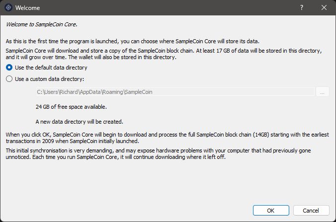
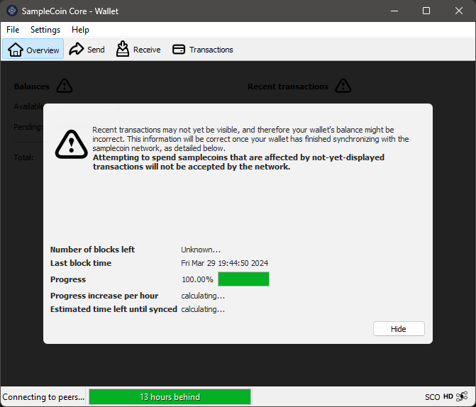

[Português do Brasil](./guide-PT.md) | [English US](./guide-EN.md) | [Español](./guide-ES.md) | [русский](./guide-RU.md) | [简体中文](./guide-ZH.md)

# SampleCoin – Guía para Principiantes

Introducción:
=========================================================

En esta guía, presentamos una serie de pasos simples que cualquier persona, incluso sin experiencia previa, puede seguir para comenzar a usar su criptomoneda.

Cada moneda creada por CryptoGera se pone automáticamente a disposición en un repositorio público en https://git.cryptogera.com. Esto no solo facilita el acceso al código fuente y a los programas de instalación, sino que también es crucial para garantizar que el código no haya sido manipulado fraudulentamente, validando así la integridad y legitimidad de la moneda.

El repositorio específico para la moneda SampleCoin se encuentra en https://git.cryptogera.com/cryptogera/samplecoin.

Aquí encontrarás el código fuente de la moneda, junto con binarios: programas compilados listos para su instalación y uso en Windows y Linux.

A continuación, te mostraremos cómo descargar e instalar este software, así como una introducción para minar tus primeras monedas.

Descargar e instalar la billetera de la moneda
---------------------------------------------------------

Para descargar la billetera, accede a la pestaña "Releases" en el repositorio de la moneda. Para la moneda SampleCoin, la dirección para "Releases" es:

[https://git.cryptogera.com/cryptogera/samplecoin/releases](https://git.cryptogera.com/cryptogera/samplecoin/releases)

En la página mencionada, encontrarás varios paquetes zip que contienen el software correspondiente.

Para usuarios de Windows, descarga el paquete "samplecoin-0.15.1-win64.zip". Si la versión de 64 bits no funciona en tu sistema, prueba la versión de 32 bits, llamada "samplecoin-0.15.1-win32.zip".

> Para usuarios de Linux, hay otro paquete disponible llamado "samplecoin-0.15.1-linux-x86_64.zip", que requiere un poco más de conocimiento para instalar. Si estás utilizando Ubuntu, puedes extraer este archivo en la carpeta "/" de tu computadora para que los binarios se coloquen en "/usr/bin".

Cuando abras el paquete zip, verás un programa ejecutable con la extensión ".exe". Este es el instalador de la billetera para Windows. Para iniciar la instalación, simplemente haz doble clic en él. Aparecerá una ventana similar a esta:

La instalación es similar a cualquier otra instalación de Windows que hayas realizado anteriormente. Simplemente sigue los pasos hasta que la instalación esté completa. Al final, la billetera de la moneda SampleCoin estará instalada:

Ejecutar "SampleCoin Core" por primera vez
---------------------------------------------------------

Abramos tu billetera recién instalada. Para hacerlo, simplemente haz clic en el ícono de "SampleCoin Core" que aparece en el menú de tu Windows.

La primera vez que abras tu billetera, verás una ventana similar a esta:

Aunque es posible, no recomendamos cambiar la ubicación (carpeta) donde guardarás tu billetera y los datos de la blockchain. Haz clic en el botón `OK` para usar la ubicación predeterminada.

> Si eres un usuario principiante, elegir una ubicación diferente para almacenar los datos traerá implicaciones que dificultarán, por ejemplo, la creación de copias de seguridad. Más adelante en esta guía, explicaremos cómo restaurar una copia de seguridad de tu billetera. Sin embargo, si has cambiado la carpeta donde guardas los datos de la billetera, las instrucciones no funcionarán.

A continuación, verás una ventana similar a esta debajo, que muestra que tu billetera está intentando descargar datos de la blockchain, es decir, tratando de sincronizar su base de datos local con la base de datos de la red de datos de la moneda SampleCoin.

Las monedas de la familia de Bitcoin, como es el caso de la moneda SampleCoin, operan en una red distribuida y descentralizada. Esta red está compuesta por "nodos", que son las propias billeteras que interactúan entre sí. Estos "nodos" usan una base de datos compartida entre todos ellos, llamada "blockchain".

Tu billetera, cada vez que se abre, intenta conectarse a los otros "nodos" de la red para sincronizar datos de la blockchain. Esta ventana se mantendrá abierta e inmóvil, sin poder sincronizar, en dos situaciones:

- Cuando no encuentra otro "nodo" en la red, ya sea debido a una conexión a Internet fallida o porque no hay otros "nodos" en línea en ese momento;
- Cuando no hay nuevas transacciones confirmadas, porque nadie está "minando" nuevos bloques.

Como tu moneda es nueva, es normal que no tenga nada que sincronizar, así que se verá así. Lo primero que debes hacer para "dar vida" a la blockchain de la moneda SampleCoin es minar el primer bloque. Mira en el siguiente paso cómo hacerlo.

Minar tu primer bloque
---------------------------------------------------------

Hay varias formas de minar criptomonedas. Los más comunes son:

- A través de comandos en la **ventana de depuración** de la billetera de la moneda;
- A través de la línea de comandos, utilizando el propio cliente de la moneda, en este caso, el "samplecoin-cli";
- Usando software de minería junto con un servidor RPC;
- Usando software de minería conectado a un grupo de minería;
- Usando equipos de minería conectados a un grupo de minería.

El primero es la forma más rápida y sencilla, y aunque no es eficiente para blockchains que ya han crecido, funciona muy bien para una criptomoneda recién creada.

Para minar tu primer bloque, abre la billetera "SampleCoin Core" que instalaste en Windows, accede al menú "Help", elige "Debug Window" y activa la pestaña "Console":

En el espacio que aparece en la parte inferior de la pestaña Console, escribe `generate 1`:

Presiona ENTER y espera a que aparezca una respuesta. El tiempo de espera de una respuesta depende de la potencia de procesamiento de tu computadora. Puedes enviar el comando `generate 1` nuevamente antes de recibir una respuesta, pero ten en cuenta que cada comando enviado desencadena un proceso de minería adicional que requiere más recursos de tu procesador y puede congelar tu billetera. Si esto sucede, deberás cerrar y volver a abrir la billetera "SampleCoin Core".

Si recibes una respuesta como esta, con 2 corchetes vacíos, significa que el bloque no se generó:

Es posible que necesites repetir el comando `generate 1` varias veces hasta encontrar un bloque, lo cual es normal. Solo asegúrate de no enviar el comando `generate 1` excesivamente para evitar congelar tu billetera. A continuación, un ejemplo de varios intentos realizados:

Y finalmente, algunas respuestas exitosas después de varios intentos del comando `generate 1`. Observa que cuando se mina un bloque correctamente, aparece una secuencia de letras y números entre corchetes:

Los bloques que acabas de minar aparecerán en tu billetera, cada uno como una recompensa de 50 monedas:

Pero espera, las monedas de recompensa aún no son tuyas. Cada nuevo bloque minado necesita recibir 101 confirmaciones antes de ser pagado. Para esto, se necesitan minar otros 101 bloques en la blockchain, por ti o por otras personas. Cuando esto suceda, estas monedas estarán disponibles automáticamente en tu billetera.

> En Linux, los pasos serían, primero, iniciar el samplecoind en modo daemon con el comando `samplecoind –daemon` y luego usar el cliente para generar el bloque con el comando `samplecoin-cli generate 1`.

Protege tu billetera con una contraseña
---------------------------------------------------------

Una billetera recién instalada no tiene contraseña, lo que pone tus monedas en riesgo si otras personas tienen acceso a tu computadora.

Para crear una nueva contraseña, necesitas acceder al menú "Settings" y elegir "Encrypt Wallet":

Luego, ingresa la nueva contraseña (frase de contraseña) para proteger tu billetera. La misma contraseña debe ingresarse en ambos campos. Se recomienda que la contraseña esté compuesta por al menos 10 caracteres aleatorios o ocho palabras o más. Toma nota de la contraseña proporcionada y haz clic en `OK` para continuar:

A continuación, verás esta advertencia importante, que alerta que si olvidas tu contraseña, TODAS LAS MONEDAS EN TU BILLETERA se perderán. Si deseas continuar asegurando tu billetera, responde "Sí":

Finalmente, aparece una alerta de que, incluso encriptada, tu billetera no es invulnerable ni está protegida contra malware si tu computadora está infectada. También advierte que, si has hecho una copia de seguridad antes de encriptar tu billetera, estará desprotegida y, por lo tanto, deberá ser reemplazada por una nueva copia de seguridad:

Haz clic en el botón `OK`, y el proceso de encriptación comenzará. No interrumpas el proceso, incluso si parece atascado, como se muestra a continuación:

Esta ventana en blanco desaparecerá por sí sola una vez que se complete el proceso.

¡Listo! Tu billetera está encriptada y, a partir de ahora, cada vez que envíes monedas, deberás ingresar esta contraseña (frase de contraseña).

> Nunca olvides la contraseña de tu billetera. Sin ella, nunca tendrás acceso a las monedas en tu billetera.

En el futuro, ¿cómo cambiar la contraseña de la billetera?
---------------------------------------------------------

Si la billetera está encriptada, en el menú "Settings", verás que la opción "Encrypt Wallet" aparece deshabilitada, y la opción "Change passphrase" está habilitada. Usa esta opción si alguna vez deseas cambiar la contraseña de tu billetera.

Cómo hacer una copia de seguridad de tu billetera
---------------------------------------------------------

En el menú desplegable que aparece al hacer clic en "File", elige la opción "Backup Wallet...".

Se abrirá un cuadro de diálogo para que selecciones la ubicación donde deseas guardar el archivo de copia de seguridad. Elige una ubicación segura en tu computadora o en un dispositivo de almacenamiento externo.

Dale un nombre significativo al archivo de copia de seguridad, por ejemplo, "wallet_backup.dat". Haz clic en "Save" para completar el proceso.

Asegúrate de que el archivo de copia de seguridad se haya guardado correctamente en la ubicación deseada.

**¡IMPORTANTE!** Es crucial almacenar tu archivo de copia de seguridad en un lugar seguro y preferiblemente encriptado, como una unidad externa o un servicio de almacenamiento en la nube confiable.

Siguiendo estos pasos, habrás respaldado tu billetera SampleCoin Core utilizando la opción "File -> Backup Wallet" en Windows. Asegúrate de hacer nuevos respaldos regularmente para garantizar la seguridad de tus monedas.

Cómo restaurar una copia de seguridad de tu billetera
---------------------------------------------------------

> **¡ALERTA!** Nunca restaures copias de seguridad antiguas sobre billeteras actuales. Al restaurar una copia de seguridad de tu billetera, cualquier transacción o saldo realizado después de esta copia de seguridad se perderá porque la copia de seguridad sobrescribirá el estado actual de tu billetera con el estado en el momento en que se realizó la copia de seguridad. Por lo tanto, es importante hacer copias de seguridad regularmente y mantener buenas prácticas de seguridad para proteger tus monedas.

### Paso 1: Cierra "SampleCoin Core"

Si "SampleCoin Core" está abierto, ciérralo completamente antes de proceder con la restauración de la billetera.

### Paso 2: Localiza el archivo de copia de seguridad

Asegúrate de tener acceso al archivo de copia de seguridad de tu billetera. Esto generalmente será un archivo con la extensión ".dat" que guardaste previamente.

### Paso 3: Accede a la carpeta de datos de "SampleCoin Core"

Abre el Explorador de archivos de Windows.

Navega a `%appdata%\samplecoin`. Simplemente puedes copiar y pegar `%appdata%\samplecoin` en la barra de direcciones del Explorador de archivos y presionar Enter para acceder rápidamente a esta carpeta.

### Paso 4: Haz una copia de seguridad de tu billetera existente (opcional)

Antes de proceder con la restauración, es buena práctica hacer una copia de seguridad de tu billetera existente en caso de que haya alguna información importante que no desees perder.

### Paso 5: Reemplaza el archivo de billetera existente con la copia de seguridad

En el directorio `%appdata%\samplecoin`, encuentra el archivo de billetera existente, que generalmente tiene el nombre "wallet.dat".

Cambia el nombre de "wallet.dat" a "wallet-previous.dat" o copia este archivo en otra carpeta como precaución.

Copia el archivo de copia de seguridad de tu billetera al directorio `%appdata%\samplecoin` y cámbiale el nombre a "wallet.dat".

### Paso 6: Inicia "SampleCoin Core"

Después de reemplazar el archivo de billetera, inicia nuevamente "SampleCoin Core".

### Paso 7: Verifica que la restauración haya sido exitosa

Una vez que "SampleCoin Core" esté abierto, verifica que tu billetera se haya restaurado correctamente. Verifica el saldo y las transacciones para asegurarte de que todo esté como se espera.

Enviar y recibir monedas
---------------------------------------------------------

"SampleCoin Core" ofrece una amplia gama de funciones para enviar y recibir monedas de forma segura. Sigue esta guía paso a paso para aprender cómo usar estas funcionalidades:

### Enviar monedas:

1. **Abre "SampleCoin Core":**
   - Inicia la aplicación "SampleCoin Core" en tu computadora.

2. **Accede a tu billetera:**
   - Después de abrir "SampleCoin Core", espera a que se cargue tu billetera. Deberás ingresar tu contraseña, si la tienes, para desbloquear tu billetera.

3. **Selecciona "Enviar":**
   - En el menú principal, haz clic en "Send" o encuentra la opción de enviar en la barra de navegación.

4. **Completa los detalles de la transacción:**
   - Ingresa la dirección de "SampleCoin" del destinatario en el campo designado.
   - Especifica la cantidad que deseas enviar en SampleCoin.
   - Agrega una tarifa de transacción si lo deseas. Una tarifa más alta generalmente resulta en una confirmación de transacción más rápida.

5. **Revisa y confirma:**
   - Antes de enviar la transacción, revisa cuidadosamente los detalles, como la dirección de destino y la cantidad.
   - Confirma la transacción y espera la confirmación en la blockchain.

### Recibir monedas:

1. **Obtén tu dirección de "SampleCoin":**
   - En "SampleCoin Core", ve a la sección "Receive" o encuentra la dirección de "SampleCoin" en tu billetera.
   - Copia la dirección de "SampleCoin" proporcionada.

2. **Comparte tu dirección:**
   - Pega la dirección de "SampleCoin" en un correo electrónico, mensaje o plataforma de pago para que el remitente te envíe monedas.

3. **Verifica la recepción:**
   - Espera a que el remitente envíe las monedas a tu dirección.
   - Una vez que se reciban las monedas, aparecerán en tu billetera "SampleCoin Core".

4. **Confirmación de la blockchain:**
   - La transacción se registrará en la blockchain, y después de algunas confirmaciones, las monedas se considerarán recibidas por completo y estarán disponibles para su uso.

Recuerda siempre mantener segura tu clave privada y hacer copias de seguridad regularmente de tu billetera "SampleCoin Core" para garantizar la seguridad de tus monedas.

Recomendaciones Finales
---------------------------------------------------------

- **Registra un dominio de Internet para tu moneda:**
  - Asegura una sólida presencia en línea registrando un dominio dedicado para tu moneda. Esto facilita la creación de un sitio web oficial y proporciona un punto central para información y comunicación con la comunidad.

- **Registra la marca de tu moneda:**
  - Protege la identidad y reputación de tu moneda registrando su marca. Esto ayuda a evitar posibles conflictos legales y promueve la confianza entre los usuarios e inversores.

- **Promociona tu moneda en todos los lugares posibles:**
  - Utiliza las redes sociales, los foros relacionados, los blogs y otros canales para promocionar tu moneda. Cuantas más personas conozcan tu moneda, mayor será su adopción y aprecio.

- **Mina y fomenta la minería tanto como sea posible:**
  - La minería es esencial para la seguridad y descentralización de tu moneda. Fomenta la minería ofreciendo recompensas justas y promoviendo la minería dentro de tu comunidad.

- **Lanza un explorador de blockchain:**
  - Un explorador de blockchain permite a los usuarios ver transacciones, saldos de cuentas y otra información importante sobre tu moneda. Pon un explorador a disposición para aumentar la transparencia y confianza en tu moneda.

- **Desarrolla una aplicación de billetera para tu moneda:**
  - Facilita el acceso y uso de tu moneda desarrollando una billetera móvil para dispositivos iOS y Android. Esto permite a los usuarios administrar sus monedas de manera conveniente y segura.

- **Incluye tu moneda en grupos de minería:**
  - Los grupos de minería son grupos de mineros que combinan su poder de procesamiento para aumentar las posibilidades de encontrar bloques y recibir recompensas. Lista tu moneda en diferentes grupos para atraer a más mineros.

- **Enumera tu moneda en agregadores e intercambios:**
  - Haz que tu moneda esté disponible para comprar, vender y negociar mediante su inclusión en plataformas de intercambio de criptomonedas populares. Esto aumenta su accesibilidad y liquidez.
