[Português do Brasil](./guide-PT.md) | [English US](./guide-EN.md) | [Español](./guide-ES.md) | [русский](./guide-RU.md) | [简体中文](./guide-ZH.md)

# SampleCoin – Guia do Iniciante

Introdução:
=========================================================

Neste guia, apresentamos uma série de passos simples, que qualquer pessoa, mesmo sem experiência prévia, pode seguir para começar a utilizar sua criptomoeda.

Cada moeda criada pelo CryptoGera é disponibilizada automaticamente em um repositório público em https://git.cryptogera.com. Isso não só facilita o acesso ao código-fonte e aos programas de instalação, mas também é crucial para garantir que o código não tenha sido manipulado de maneira fraudulenta, validando assim a integridade e a legitimidade da moeda.

O repositório específico da moeda SampleCoin está localizado em https://git.cryptogera.com/cryptogera/samplecoin.

Neste local, você encontrará o código-fonte da moeda, junto com os binários - os programas compilados prontos para instalação e uso tanto no Windows quanto no Linux.

Abaixo, mostraremos como baixar e instalar esse software, além de oferecer uma introdução à mineração de suas primeiras moedas.

Baixe e instale a carteira da moeda
---------------------------------------------------------

Para baixar a carteira, acesse a aba "Releases" no repositório da moeda. No caso da moeda SampleCoin, o endereço para os "Releases" é:

[https://git.cryptogera.com/cryptogera/samplecoin/releases](https://git.cryptogera.com/cryptogera/samplecoin/releases)

Na página mencionada, você encontrará vários pacotes compactados com a extensão ".zip", contendo o software correspondente.

Para usuários do Windows, baixe o pacote "samplecoin-0.15.1-win64.zip". Se a versão de 64 bits não funcionar em seu sistema, tente a versão de 32 bits, chamada "samplecoin-0.15.1-win32.zip".

> Para usuários do Linux, há outro pacote disponível, chamado "samplecoin-0.15.1-linux-x86_64.zip", que requer um pouco mais de conhecimento para instalar. Se estiver usando o Ubuntu, você pode extrair esse arquivo na pasta "/" do seu computador para que os binários sejam colocados em "/usr/bin".

Ao abrir o pacote zip, você verá um programa executável com a extensão ".exe". Este é o instalador da carteira para Windows. Para iniciar a instalação, basta dar dois cliques nele. Uma janela semelhante a esta será exibida:

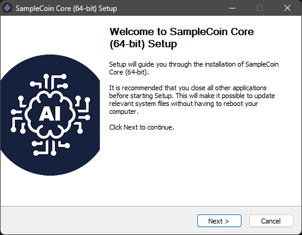

A instalação é semelhante a qualquer outra instalação do Windows que você já tenha realizado. Basta seguir os passos até concluir a instalação. Ao final, a carteira da moeda "SampleCoin" estará instalada:

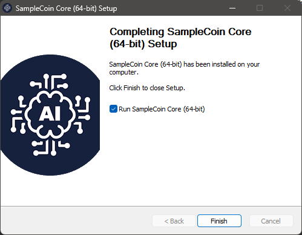

Rodando o "SampleCoin Core" pela primeira vez
---------------------------------------------------------

Vamos abrir sua carteira recém-instalada. Para isso, basta clicar no ícone "SampleCoin Core" que aparece no menu do seu Windows.

Na primeira vez que você abrir sua carteira, verá uma janela semelhante a esta:

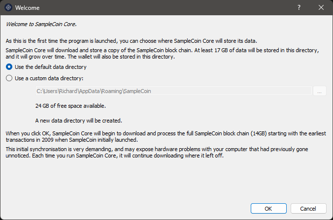

Embora seja possível, não recomendamos que você altere o local (pasta) onde irá manter os dados da sua carteira e do blockchain. Clique no botão `OK` para utilizar o local padrão.

> Se você é um usuário iniciante, escolher um local diferente para armazenar os dados trará implicações que dificultarão, por exemplo, a questão de cópias de segurança. Mais adiante neste guia, explicaremos como restaurar uma cópia de segurança da sua carteira. No entanto, se você tiver mudado a pasta onde guarda os dados da carteira, as instruções não irão funcionar.

Em seguida, você verá uma janela semelhante a esta abaixo, que mostra que sua carteira está tentando baixar os dados do blockchain, ou seja, está tentando sincronizar a base de dados local dela com a base de dados da rede de dados da moeda SampleCoin.

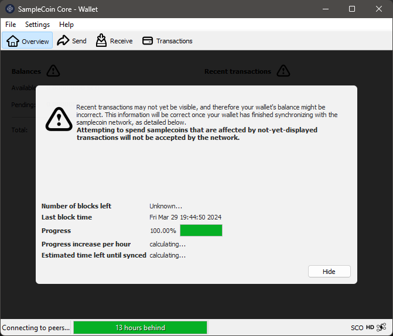

As moedas da família Bitcoin, como é o caso da moeda SampleCoin, funcionam em uma rede distribuída e descentralizada. Essa rede é composta por "nodes", que são as próprias carteiras interagindo umas com as outras. Esses "nodes" utilizam uma base de dados compartilhada entre todos eles, denominada "blockchain".

Sua carteira, toda vez que é aberta, tenta se conectar aos outros "nodes" da rede para sincronizar os dados do blockchain. Esta janela ficará aberta e parada, sem conseguir sincronizar, em duas situações:

- Quando não encontrar outro "node" na rede, seja por falha na conexão à internet ou por inexistência de outro "node" no ar no momento;

- Quando não houverem novas transações confirmadas, porque ninguém está "minerando" novos blocos.

Como sua moeda é nova, é normal que ela não tenha nada para sincronizar, por isso ela ficará desse jeito. A primeira coisa que você precisa fazer para "dar vida" ao blockchain da moeda "SampleCoin" é minerar o primeiro bloco. Veja no próximo passo como fazer isso.

Minere seu primeiro bloco
---------------------------------------------------------

Existem várias formas de minerar criptomoedas. As mais comuns são:

- Através de comandos na **janela de depuração** da carteira da moeda;
- Através da linha de comando, utilizando o cliente da própria moeda, no caso o "samplecoin-cli";
- Utilizando um software de mineração em conjunto com um servidor RPC;
- Utilizando um software de mineração conectado a um pool de mineração;
- Utilizando um equipamento de mineração conectado a um pool de mineração.

A primeira é a forma mais rápida e simples e, embora não seja eficiente para blockchains que já cresceram, funciona muito bem para uma criptomoeda que acabou de ser criada.

Para minerar seu primeiro bloco, abra a carteira "SampleCoin Core" que você instalou no Windows, acesse o menu "Ajuda", escolha "Janela de Depuração" e ative a aba "Console":

Na lacuna que aparece na parte inferior da aba de Console, digite `generate 1`:

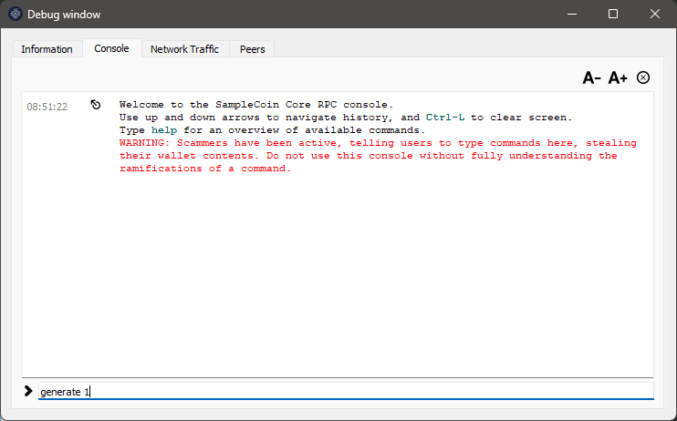

Pressione ENTER e aguarde até que surja alguma resposta. O tempo de espera pela resposta depende da capacidade de processamento do seu computador. Você pode enviar o comando `generate 1` novamente antes de receber uma resposta, mas saiba que cada comando enviado aciona um processo adicional de mineração que exige mais recursos do seu processador e pode congelar sua carteira. Se isso acontecer, será necessário fechar e abrir o "SampleCoin Core" novamente.

Se você receber uma resposta como esta, com 2 colchetes vazios, significa que o bloco não foi gerado:

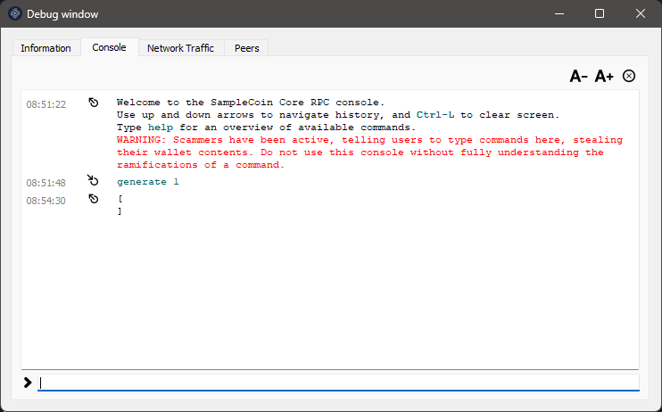

Pode ser necessário repetir o comando `generate 1` algumas vezes até encontrar um bloco, o que é normal. Apenas certifique-se de não enviar o comando `generate 1` excessivamente para não congelar sua carteira. Abaixo, um exemplo de várias tentativas feitas:

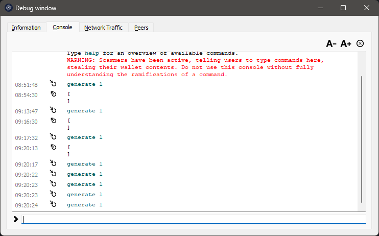

E finalmente, algumas respostas com sucesso, após várias tentativas do comando `generate 1`. Observe que, quando um bloco é minerado com sucesso, aparece uma sequência de letras e números entre colchetes:

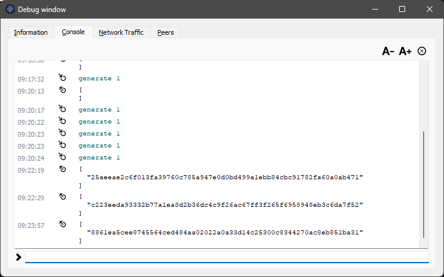

Os blocos que você acabou de minerar aparecem na sua carteira, cada um como uma recompensa de 50 moedas:

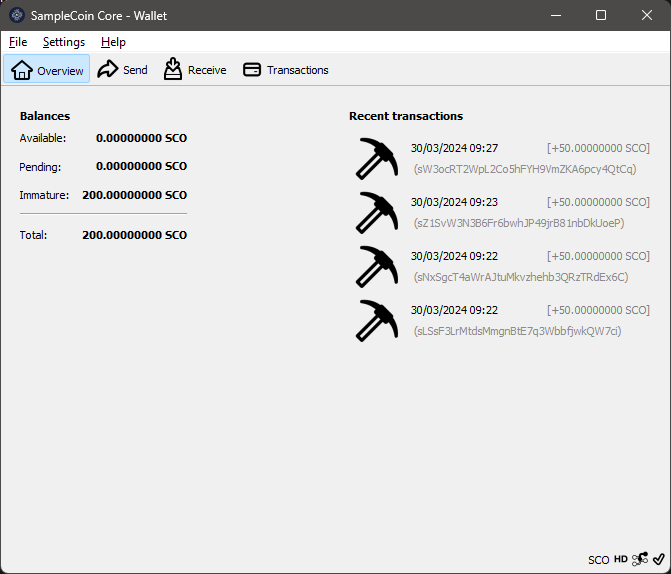

Mas calma, as moedas da recompensa ainda não são suas. Cada novo bloco minerado precisa receber 101 confirmações antes de ser pago. Para isso, mais 101 blocos precisam ser minerados no blockchain, por você ou por outras pessoas. Quando isso acontecer, essas moedas ficarão automaticamente disponíveis na sua carteira.

> No Linux, os passos seriam, primeiramente, iniciar o samplecoind em modo daemon com o comando `samplecoind –daemon` e, em seguida, usar o cliente para gerar o bloco com o comando `samplecoin-cli generate 1`.

Proteja sua carteira com uma senha
---------------------------------------------------------

Uma carteira recém-instalada não possui senha, o que coloca suas moedas em risco caso outras pessoas tenham acesso ao seu computador.

Para criar uma nova senha, você precisa acessar o menu "Definições" e escolher "Criptografar Carteira":

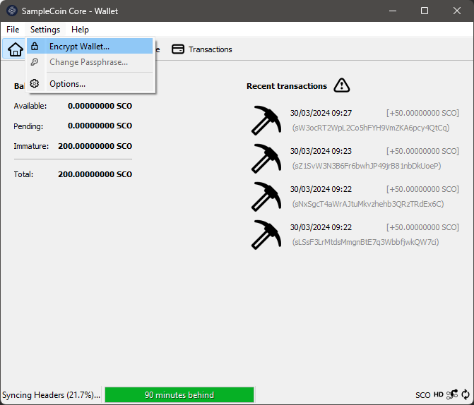

Em seguida, informe a nova senha (passphrase) para proteger sua carteira. A mesma senha precisa ser digitada nas duas lacunas. Recomenda-se que a senha seja composta por pelo menos 10 caracteres aleatórios ou oito ou mais palavras. Tome nota da senha informada e clique em `OK` para prosseguir:

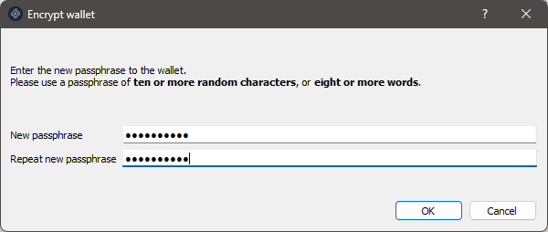

Depois, você verá este importante aviso, que alerta que caso você esqueça sua senha, TODAS AS MOEDAS DA SUA CARTEIRA serão perdidas. Se deseja prosseguir instalando a proteção da sua carteira, responda "Sim":

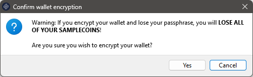

Finalmente, surge um alerta de que, mesmo criptografada, sua carteira não é invulnerável ou à prova de malware caso seu computador seja infectado. Também avisa que, caso você tenha feito algum backup antes de criptografar sua carteira, ele estará desprotegido e, por isso, deve ser substituído por um novo backup:

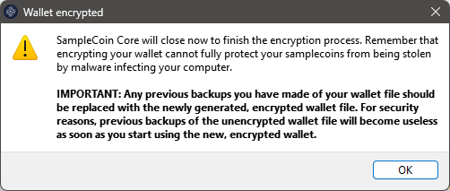

Clique no botão `OK` e o processo de criptografia irá começar. Não interrompa o processo, mesmo se ele parecer travado, como mostrado abaixo:

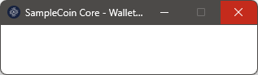

Essa janela em branco irá desaparecer sozinha assim que o processo terminar.

Pronto! Sua carteira está criptografada e, a partir de agora, sempre que você for enviar moedas, precisará informar essa senha (passphrase).

> Jamais esqueça a senha da sua carteira. Sem ela, você nunca mais terá acesso às moedas da sua carteira.

No futuro, como trocar a senha da carteira?
---------------------------------------------------------

Se a carteira estiver criptografada, no menu "Definições", você verá que a opção "Criptografar Carteira" aparece desabilitada e a opção "Mudar frase de segurança" habilitada. Use essa opção se algum dia desejar mudar a senha da sua carteira.

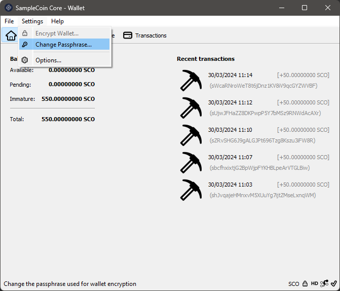

Como fazer uma cópia de segurança da sua carteira
---------------------------------------------------------

No menu suspenso que aparece ao clicar em "File", escolha a opção "Backup Wallet..." (Fazer backup da carteira).

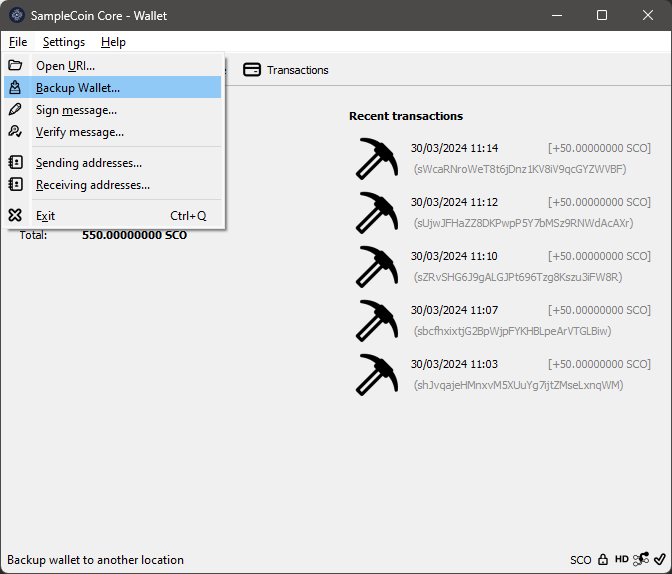

Uma janela de diálogo será aberta para você selecionar o local onde deseja salvar o arquivo de backup. Escolha uma localização segura no seu computador ou em um dispositivo de armazenamento externo.

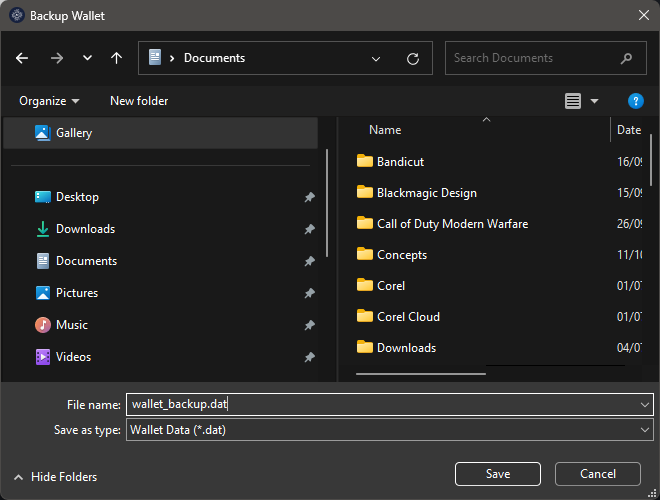

Dê um nome significativo ao arquivo de backup, por exemplo, "wallet_backup.dat". Clique em "Salvar" para concluir o processo.

Certifique-se de que o arquivo de backup tenha sido salvo com sucesso no local desejado.

**IMPORTANTE!** É crucial armazenar seu arquivo de backup em um local seguro e, de preferência, criptografado, como uma unidade externa ou serviço de armazenamento em nuvem confiável.

Ao seguir esses passos, você terá feito um backup da sua carteira SampleCoin Core usando a opção "File -> Backup Wallet" no Windows. Certifique-se de fazer novos backups regularmente para garantir a segurança das suas moedas.

Como restaurar uma cópia de segurança da sua carteira
---------------------------------------------------------

> **ALERTA!** Jamais restaure backups antigos em cima de carteiras atuais. Ao restaurar um backup da sua carteira, qualquer transação ou saldo feito após este backup será perdida, pois o backup substituirá o estado atual da sua carteira pelo estado no momento em que o backup foi feito. Portanto, é importante fazer backups regularmente e manter uma boa prática de segurança para proteger suas moedas.

### Passo 1: Feche o "SampleCoin Core"

Se o "SampleCoin Core" estiver aberto, feche-o completamente antes de prosseguir com a restauração do backup.

### Passo 2: Localize o arquivo de backup

Certifique-se de ter acesso ao arquivo de backup da sua carteira. Isso geralmente será um arquivo com extensão ".dat" que você salvou anteriormente.

### Passo 3: Acesse a pasta de dados do "SampleCoin Core"

Abra o Explorador de Arquivos do Windows.

Navegue até `%appdata%\samplecoin`. Você pode simplesmente copiar e colar `%appdata%\samplecoin` na barra de endereços do Explorador de Arquivos e pressionar Enter para acessar essa pasta rapidamente.

### Passo 4: Faça backup da sua carteira existente (opcional)

Antes de prosseguir com a restauração, é uma boa prática fazer backup da sua carteira existente, caso haja alguma informação importante que você não queira perder.

### Passo 5: Substitua o arquivo de carteira existente pelo backup

No diretório `%appdata%\samplecoin`, encontre o arquivo de carteira existente, que geralmente tem o nome "wallet.dat".

Renomeie "wallet.dat" para "wallet-previous.dat" ou copie este arquivo para outra pasta como precaução.

Copie o arquivo de backup da sua carteira para o diretório `%appdata%\samplecoin` e ajuste o nome dele para "wallet.dat".

### Passo 6: Inicie o "SampleCoin Core"

Após substituir o arquivo de carteira, inicie o "SampleCoin Core" novamente.

### Passo 7: Verifique se a restauração foi bem-sucedida

Assim que o "SampleCoin Core" estiver aberto, verifique se sua carteira foi restaurada corretamente. Verifique o saldo e as transações para garantir que tudo esteja como esperado.

Enviando e recebendo moedas
---------------------------------------------------------

O "SampleCoin Core" oferece uma ampla gama de recursos para enviar e receber moedas de forma segura. Siga este passo a passo para aprender como utilizar essas funcionalidades:

### Enviando Moedas:

1. **Abra o "SampleCoin Core":**
   - Inicie o aplicativo "SampleCoin Core" em seu computador.

2. **Acesse sua Carteira:**
   - Após abrir o "SampleCoin Core", aguarde até que sua carteira seja carregada. Você precisará inserir sua senha, se houver, para desbloquear sua carteira.

3. **Selecione "Enviar":**
   - No menu principal, clique em "Enviar" ou encontre a opção de envio na barra de navegação.

4. **Preencha os Detalhes da Transação:**
   - Insira o endereço "SampleCoin" do destinatário no campo designado.
   - Especifique o valor que deseja enviar em SampleCoin.
   - Adicione uma taxa de transação, se desejar. Uma taxa mais alta geralmente resulta em uma confirmação mais rápida da transação.

5. **Revisão e Confirmação:**
   - Antes de enviar a transação, verifique cuidadosamente os detalhes, como o endereço de destino e o valor.
   - Confirme a transação e aguarde a confirmação na blockchain.

### Recebendo Moedas:

1. **Obtenha seu Endereço "SampleCoin":**
   - No "SampleCoin Core", vá para a seção "Receber" ou encontre o endereço "SampleCoin" em sua carteira.
   - Copie o endereço "SampleCoin" fornecido.

2. **Compartilhe seu Endereço:**
   - Cole o endereço "SampleCoin" em um email, mensagem ou plataforma de pagamento para o remetente enviar as moedas para você.

3. **Verifique o Recebimento:**
   - Aguarde até que o remetente envie as moedas para o seu endereço.
   - Assim que as moedas forem recebidas, elas aparecerão em sua carteira "SampleCoin Core".

4. **Confirmação na Blockchain:**
   - A transação será registrada na blockchain e, após algumas confirmações, as moedas serão consideradas totalmente recebidas e disponíveis para uso.

Lembre-se sempre de manter sua chave privada segura e fazer backup regularmente de sua carteira "SampleCoin Core" para garantir a segurança de suas moedas.

Recomendações finais
---------------------------------------------------------

- **Registre um domínio internet para sua moeda:**
  - Garanta uma presença online sólida registrando um domínio dedicado para sua moeda. Isso facilita a criação de um site oficial e fornece um ponto central para informações e comunicação com a comunidade.

- **Registre a marca da sua moeda:**
  - Proteja a identidade e reputação da sua moeda registrando sua marca. Isso ajuda a evitar possíveis conflitos legais e promove a confiança entre os usuários e investidores.

- **Divulgue sua moeda em todos os locais possíveis:**
  - Utilize mídias sociais, fóruns relacionados, blogs e outros canais para divulgar sua moeda. Quanto mais pessoas conhecerem sua moeda, maior será sua adoção e valorização.

- **Minere e incentive a mineração o máximo que puder:**
  - A mineração é essencial para a segurança e descentralização da sua moeda. Incentive os mineradores oferecendo recompensas justas e promovendo a mineração entre sua comunidade.

- **Coloque um blockchain explorer no ar:**
  - Um explorador de blockchain permite que os usuários visualizem transações, saldos de contas e outras informações importantes sobre sua moeda. Disponibilize um explorador para aumentar a transparência e confiança na sua moeda.

- **Desenvolva um APP carteira da sua moeda:**
  - Facilite o acesso e a utilização da sua moeda desenvolvendo uma carteira móvel para dispositivos iOS e Android. Isso permite que os usuários gerenciem suas moedas de forma conveniente e segura.

- **Inclua sua moeda em mining pools:**
  - Mining pools são grupos de mineradores que combinam seu poder de processamento para aumentar as chances de encontrar blocos e receber recompensas. Liste sua moeda em diferentes pools para atrair mais mineradores.

- **Liste sua moeda em agregadores e exchanges:**
  - Torne sua moeda acessível para compra, venda e negociação listando-a em plataformas de troca de criptomoedas e agregadores de preços. Isso aumenta a liquidez e a visibilidade da sua moeda no mercado.

- **Pronto para uma ICO?:**
  - Se estiver planejando uma oferta inicial de moedas (ICO), certifique-se de seguir todas as regulamentações e requisitos legais. Prepare um whitepaper detalhado e estabeleça um cronograma claro para sua ICO.

