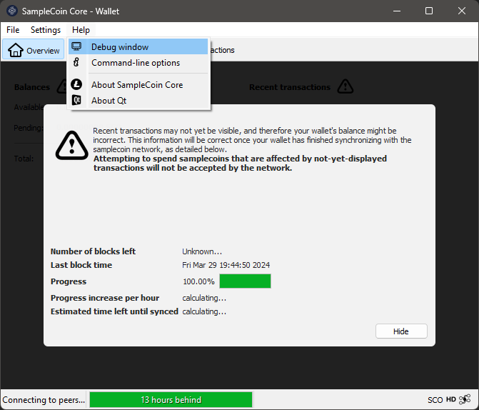
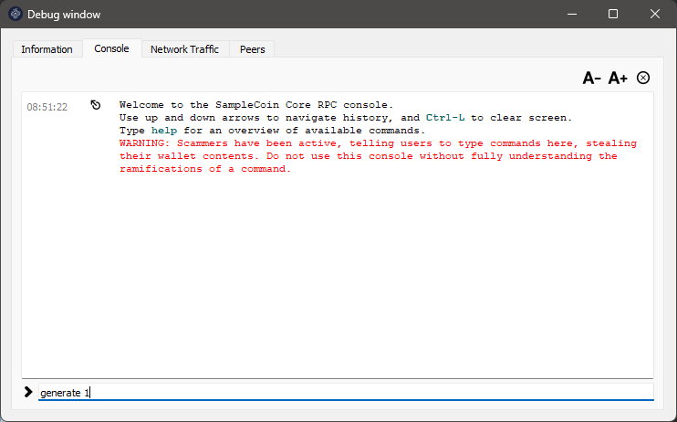
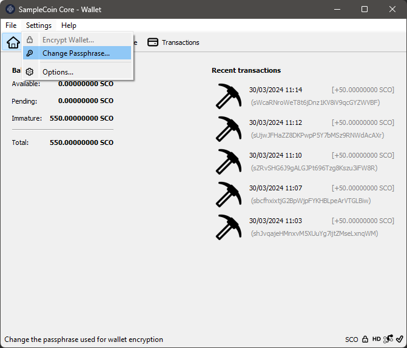

[Português do Brasil](./guide-PT.md) | [English US](./guide-EN.md) | [Español](./guide-ES.md) | [русский](./guide-RU.md) | [简体中文](./guide-ZH.md)

# Руководство для начинающих по SampleCoin

Введение:
=========================================================

В этом руководстве мы представляем серию простых шагов, которые может выполнить любой, даже не имеющий опыта, чтобы начать использовать свою криптовалюту.

Каждая монета, созданная CryptoGera, автоматически становится доступной в общем репозитории по адресу https://git.cryptogera.com. Это не только облегчает доступ к исходному коду и программам установки, но также является ключевым моментом для обеспечения того, что код не был манипулирован мошенниками, что подтверждает целостность и законность монеты.

Специфический репозиторий для монеты SampleCoin находится по адресу https://git.cryptogera.com/cryptogera/samplecoin.

Здесь вы найдете исходный код монеты, а также бинарные файлы - скомпилированные программы, готовые к установке и использованию как в Windows, так и в Linux.

Ниже мы покажем вам, как загрузить и установить это программное обеспечение, а также дадим введение в майнинг ваших первых монет.

Загрузите и установите кошелек монеты
---------------------------------------------------------

Чтобы загрузить кошелек, перейдите на вкладку "Releases" в репозитории монеты. Для монеты SampleCoin адрес для "Releases" следующий:

[https://git.cryptogera.com/cryptogera/samplecoin/releases](https://git.cryptogera.com/cryptogera/samplecoin/releases)

На указанной странице вы найдете несколько zip-пакетов, содержащих соответствующее программное обеспечение.

Для пользователей Windows загрузите пакет "samplecoin-0.15.1-win64.zip". Если 64-разрядная версия не работает на вашей системе, попробуйте 32-разрядную версию, называемую "samplecoin-0.15.1-win32.zip".

> Для пользователей Linux также доступен другой пакет с названием "samplecoin-0.15.1-linux-x86_64.zip", для установки которого требуется немного больше знаний. Если вы используете Ubuntu, вы можете извлечь этот файл в каталог "/" вашего компьютера, чтобы бинарные файлы были размещены в "/usr/bin".

Когда вы откроете zip-пакет, вы увидите исполняемую программу с расширением ".exe". Это установщик кошелька для Windows. Чтобы начать установку, просто дважды щелкните по нему. Появится окно, подобное этому:

Установка аналогична любой другой установке в Windows, которую вы выполняли раньше. Просто следуйте шагам, пока установка не будет завершена. В конце кошелек монеты SampleCoin будет установлен:

Запуск "SampleCoin Core" впервые
---------------------------------------------------------

Давайте откроем ваш только что установленный кошелек. Для этого просто нажмите на значок "SampleCoin Core", который появится в меню вашего Windows.

Первый раз, когда вы откроете свой кошелек, вы увидите окно, похожее на это:

Хотя это возможно, мы не рекомендуем изменять местоположение (папку), где вы будете хранить свой кошелек и данные блокчейна. Щелкните кнопку `OK`, чтобы использовать местоположение по умолчанию.

> Если вы новый пользователь, выбор другого места для хранения данных приведет к последствиям, которые затруднят, например, создание резервных копий. Позже в этом руководстве мы объясним, как восстановить резервную копию вашего кошелька. Однако, если вы изменили папку, где хранятся данные кошелька, инструкции не сработают.

Далее вы увидите окно, похожее на это ниже, которое показывает, что ваш кошелек пытается загрузить данные блокчейна, то есть синхронизировать свою локальную базу данных с базой данных сети данных монеты SampleCoin.

Монеты семейства Биткоин, как в случае с монетой SampleCoin, работают на распределенной и децентрализованной сети. Эта сеть состоит из "узлов", которые сами являются кошельками и взаимодействуют друг с другом. Эти "узлы" используют общую базу данных между собой, называемую "блокчейном".

Ваш кошелек каждый раз, когда он открывается, пытается подключиться к другим "узлам" сети для синхронизации данных блокчейна. Это окно останется открытым и неподвижным, не смогу синхронизироваться, в двух ситуациях:

- Когда он не находит другой "узел" в сети, либо из-за отсутствия интернет-соединения, либо потому, что в данный момент нет других "узлов" онлайн;
- Когда нет новых подтвержденных транзакций, потому что никто не "майнит" новые блоки.

Поскольку ваша монета новая, естественно, что ей нечего синхронизировать, поэтому это будет выглядеть так. Первое, что вам нужно сделать, чтобы "оживить" блокчейн монеты SampleCoin, это майнить первый блок. В следующем шаге вы увидите, как это сделать.

Майнинг вашего первого блока
---------------------------------------------------------

Существует несколько способов майнить криптовалюты. Самые распространенные:

- Через команды в **окне отладки** кошелька монеты;
- Через командную строку, используя сам клиент монеты, в данном случае "samplecoin-cli";
- Используя программное обеспечение для майнинга в сочетании с сервером RPC;
- Используя программное обеспечение для майнинга, подключенное к майнинговому пулу;
- Используя майнинговое оборудование, подключенное к майнинговому пулу.

Первый способ - самый быстрый и простой способ, и хотя он неэффективен для блокчейнов, которые уже выросли, он очень хорошо работает для только что созданной криптовалюты.

Чтобы майнить свой первый блок, откройте кошелек "SampleCoin Core", установленный на Windows, зайдите в меню "Справка", выберите "Окно отладки" и активируйте вкладку "Консоль":

В пространстве, которое появится внизу вкладки Консоль, введите `generate 1`:

Нажмите ENTER и дождитесь появления ответа. Время ожидания ответа зависит от мощности вашего компьютера. Вы можете отправить команду `generate 1` еще раз, прежде чем получите ответ, но помните, что каждая отправленная команда запускает дополнительный процесс майнинга, который требует больше ресурсов от вашего процессора и может заморозить ваш кошелек. Если это произойдет, вам придется закрыть и снова открыть кошелек "SampleCoin Core".

Если вы получите ответ вроде этого, с двумя пустыми скобками, это означает, что блок не был сгенерирован:

Вам может потребоваться повторить команду `generate 1` несколько раз, пока вы не найдете блок, что нормально. Просто убедитесь, что не отправляете команду `generate 1` слишком часто, чтобы избежать замораживания кошелька. Ниже приведен пример нескольких попыток:

И, наконец, несколько успешных ответов после нескольких попыток команды `generate 1`. Обратите внимание, что когда блок успешно сгенерирован, между скобками появляется последовательность букв и цифр:

Сгенерированные вами блоки появятся в вашем кошельке, каждый в качестве вознаграждения в 50 монет:

Но подождите, вознаграждение еще не ваше. Каждый новый сгенерированный блок должен получить 101 подтверждение, прежде чем быть оплаченным. Для этого еще нужно сгенерировать 101 блок на блокчейне, вами или другими людьми. Когда это произойдет, эти монеты автоматически станут доступными в вашем кошельке.

> В Linux шаги будут следующими: сначала запустите samplecoind в демоническом режиме с помощью команды `samplecoind –daemon`, а затем используйте клиент для генерации блока с помощью команды `samplecoin-cli generate 1`.

Защитите свой кошелек паролем
---------------------------------------------------------

Новый установленный кошелек не имеет пароля, что ставит ваши монеты под угрозу, если другие люди имеют доступ к вашему компьютеру.

Чтобы создать новый пароль, вам нужно зайти в меню "Настройки" и выбрать "Зашифровать кошелек":

Затем введите новый пароль (парольную фразу), чтобы защитить свой кошелек. Этот же пароль нужно ввести в обоих полях. Рекомендуется, чтобы пароль состоял как минимум из 10 случайных символов или восеми или более слов. Запишите пароль и нажмите `OK`, чтобы продолжить:

Затем появится важное предупреждение, которое предупреждает, что если вы забудете пароль, ВСЕ МОНЕТЫ В ВАШЕМ КОШЕЛЕК будут потеряны. Если вы хотите продолжить с защитой своего кошелька, ответьте "Да":

Наконец, появится предупреждение, что, даже если кошелек зашифрован, он не является непроницаемым или защищенным от вредоносного программного обеспечения, если ваш компьютер заражен. Он также предупреждает, что, если вы сделали резервную копию перед шифрованием своего кошелька, она будет не защищена и, следовательно, должна быть заменена новой резервной копией:

Нажмите кнопку `OK`, и процесс шифрования начнется. Не прерывайте процесс, даже если он кажется застрявшим, как показано ниже:

Это пустое окно исчезнет само по себе, как только процесс завершится.

Готово! Ваш кошелек зашифрован, и теперь при отправке монет вам придется вводить этот пароль (парольную фразу).

> Никогда не забывайте пароль от своего кошелька. Без него вы никогда не сможете получить доступ к монетам в своем кошельке.

В будущем, как изменить пароль кошелька?
---------------------------------------------------------

Если кошелек зашифрован, в меню "Настройки" вы увидите, что опция "Зашифровать кошелек" отключена, а опция "Изменить пароль" включена. Используйте эту опцию, если вам когда-либо понадобится изменить пароль кошелька.

Как сделать резервную копию вашего кошелька
---------------------------------------------------------

В выпадающем меню, которое появляется при нажатии на "Файл", выберите опцию "Резервное копирование кошелька...".

Откроется диалоговое окно, в котором вы можете выбрать местоположение, в котором хотите сохранить файл резервной копии. Выберите безопасное место на вашем компьютере или внешнем устройстве хранения.

Дайте понятное имя файлу резервной копии, например, "wallet_backup.dat". Нажмите "Сохранить", и ваша резервная копия будет создана.

Важно также хранить резервные копии на нескольких носителях, таких как флэш-накопители, внешние жесткие диски или даже на бумажных носителях, которые хранятся в безопасном месте. Также рекомендуется создавать резервные копии каждый раз, когда в вашем кошельке происходят существенные изменения, например, когда вы получаете или отправляете монеты.

В следующем разделе этого руководства мы рассмотрим, как восстановить кошелек с помощью этой резервной копии.

Как восстановить резервную копию вашего кошелька
---------------------------------------------------------

> **ПРЕДУПРЕЖДЕНИЕ!** Никогда не восстанавливайте старые резервные копии поверх текущих кошельков. При восстановлении резервной копии вашего кошелька любые транзакции или балансы, сделанные после этой резервной копии, будут потеряны, потому что резервная копия перезапишет текущее состояние вашего кошелька состоянием на момент создания резервной копии. Поэтому важно регулярно создавать резервные копии и соблюдать хорошие практики безопасности для защиты ваших монет.

### Шаг 1: Закройте "SampleCoin Core"

Если "SampleCoin Core" открыт, закройте его полностью перед продолжением восстановления кошелька.

### Шаг 2: Найдите файл резервной копии

Убедитесь, что у вас есть доступ к файлу резервной копии вашего кошелька. Обычно это будет файл с расширением ".dat", который вы ранее сохранили.

### Шаг 3: Доступ к папке данных "SampleCoin Core"

Откройте Проводник Windows.

Перейдите в `%appdata%\samplecoin`. Вы можете просто скопировать и вставить `%appdata%\samplecoin` в адресную строку Проводника Windows и нажать Enter, чтобы быстро получить доступ к этой папке.

### Шаг 4: Создайте резервную копию вашего текущего кошелька (по желанию)

Перед тем как приступить к восстановлению, рекомендуется создать резервную копию вашего текущего кошелька на случай, если есть какая-то важная информация, которую вы не хотите потерять.

### Шаг 5: Замените существующий файл кошелька файлом резервной копии

В каталоге `%appdata%\samplecoin` найдите существующий файл кошелька, который обычно называется "wallet.dat".

Переименуйте "wallet.dat" в "wallet-previous.dat" или скопируйте этот файл в другую папку на всякий случай.

Скопируйте файл резервной копии вашего кошелька в каталог `%appdata%\samplecoin` и переименуйте его в "wallet.dat".

### Шаг 6: Запустите "SampleCoin Core" снова

После замены файла кошелька снова запустите "SampleCoin Core".

### Шаг 7: Проверьте, что восстановление прошло успешно

После открытия "SampleCoin Core" убедитесь, что ваш кошелек был восстановлен корректно. Проверьте баланс и транзакции, чтобы убедиться, что все соответствует ожиданиям.

Отправка и получение монет
---------------------------------------------------------

"SampleCoin Core" предлагает широкий спектр функций для безопасной отправки и получения монет. Следуйте этому пошаговому руководству, чтобы узнать, как использовать эти функции:

### Отправка монет:

1. **Откройте "SampleCoin Core":**
   - Запустите приложение "SampleCoin Core" на вашем компьютере.

2. **Доступ к вашему кошельку:**
   - После открытия "SampleCoin Core" дождитесь загрузки вашего кошелька. Вам нужно будет ввести пароль, если он есть, чтобы разблокировать ваш кошелек.

3. **Выберите "Отправить":**
   - В основном меню нажмите на "Отправить" или найдите опцию отправки в панели навигации.

4. **Заполните детали транзакции:**
   - Введите адрес "SampleCoin" получателя в соответствующем поле.
   - Укажите сумму, которую хотите отправить в SampleCoin.
   - Добавьте комиссию за транзакцию, если желаете. Более высокая комиссия обычно приводит к более быстрой подтверждению транзакции.

5. **Проверьте и подтвердите:**
   - Перед отправкой транзакции внимательно проверьте детали, такие как адрес назначения и сумма.
   - Подтвердите транзакцию и дождитесь подтверждения на блокчейне.

### Получение монет:

1. **Получите свой адрес "SampleCoin":**
   - В "SampleCoin Core" перейдите в раздел "Получить" или найдите адрес "SampleCoin" в своем кошельке.
   - Скопируйте предоставленный адрес "SampleCoin".

2. **Поделитесь своим адресом:**
   - Вставьте адрес "SampleCoin" в письмо, сообщение или платежную платформу, чтобы отправитель мог отправить вам монеты.

3. **Проверьте получение:**
   - Дождитесь, пока отправитель отправит монеты на ваш адрес.
   - Как только монеты будут получены, они появятся в вашем кошельке "SampleCoin Core".

4. **Подтверждение блокчейна:**
   - Транзакция будет записана в блокчейне, и после нескольких подтверждений монеты будут считаться полностью полученными и доступными для использования.

Не забывайте держать ваш приватный ключ в безопасности и регулярно создавать резервные копии вашего кошелька "SampleCoin Core", чтобы обеспечить безопасность ваших монет.

Заключительные рекомендации
---------------------------------------------------------

- **Зарегистрируйте интернет-домен для вашей монеты:**
  - Обеспечьте прочное онлайн-присутствие, зарегистрировав специальный домен для вашей монеты. Это упрощает создание официального веб-сайта и предоставляет центральную точку для информации и общения с сообществом.

- **Зарегистрируйте бренд вашей монеты:**
  - Защитите идентичность и репутацию вашей монеты, зарегистрировав ее бренд. Это помогает избежать потенциальных юридических конфликтов и способствует доверию среди пользователей и инвесторов.

- **Продвигайте вашу монету во всех возможных местах:**
  - Используйте социальные сети, связанные форумы, блоги и другие каналы для продвижения вашей монеты. Чем больше людей узнают о вашей монете, тем больше будет ее принятие и оценка.

- **Майнинг и поощрение майнинга настолько, насколько это возможно:**
  - Майнинг необходим для безопасности и децентрализации вашей монеты. Поощряйте майнеров, предлагая справедливые награды и продвигая майнинг в вашем сообществе.

- **Запустите блокчейн-эксплорер:**
  - Блокчейн-эксплорер позволяет пользователям просматривать транзакции, балансы счетов и другую важную информацию о вашей монете. Сделайте эксплорер доступным для увеличения прозрачности и доверия к вашей монете.

- **Разработайте приложение кошелька для вашей монеты:**
  - Облегчите доступ и использование вашей монеты, разработав мобильный кошелек для устройств iOS и Android. Это позволит пользователям удобно и безопасно управлять своими монетами.

- **Включите вашу монету в майнинговые пулы:**
  - Майнинговые пулы - это группы майнеров, объединяющие свою вычислительную мощность для увеличения шансов на нахождение блоков и получение наград. Включите вашу монету в различные пулы, чтобы привлечь больше майнеров.

- **Добавьте вашу монету в агрегаторы и биржи:**
  - Сделайте вашу монету доступной для покупки, продажи и торговли, включив ее на платформы обмена криптовалютой и агрегаторы цен. Это увеличивает ликвидность и видимость вашей монеты на рынке.

- **Готовы к ICO?:**
  - Если вы планируете провести первичное предложение монет (ICO), убедитесь, что вы следуете всем правилам и юридическим требованиям. Подготовьте подробный белый документ и установите четкое расписание для вашего ICO.
