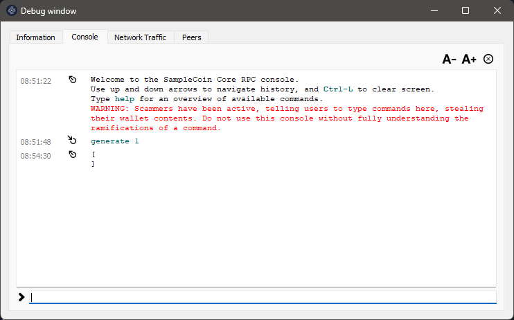
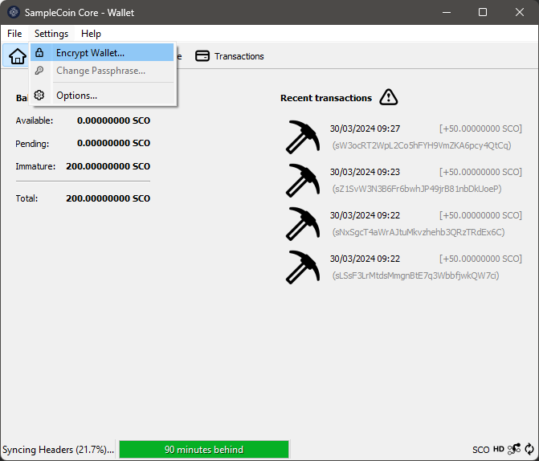
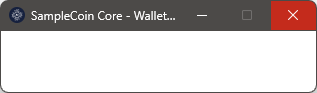
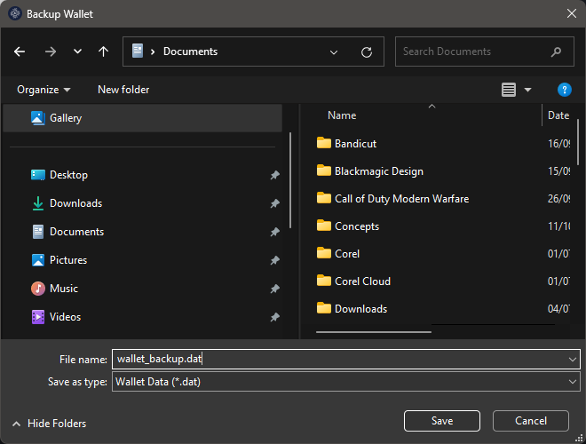

[Português do Brasil](./guide-PT.md) | [English US](./guide-EN.md) | [Español](./guide-ES.md) | [русский](./guide-RU.md) | [简体中文](./guide-ZH.md)

# SampleCoin – 入门指南

介绍:
=========================================================

在本指南中，我们将介绍一系列简单的步骤，任何人，即使没有任何经验，也可以跟随这些步骤开始使用他们的加密货币。

由 CryptoGera 创建的每种硬币都会自动在 https://git.cryptogera.com 上的公共存储库中提供。这不仅方便了访问源代码和安装程序，还至关重要，以确保代码没有被欺诈性地操纵，从而验证硬币的完整性和合法性。

SampleCoin 硬币的特定存储库位于 https://git.cryptogera.com/cryptogera/samplecoin。

在这里，您将找到硬币的源代码，以及编译好的程序 - 已经准备好在 Windows 和 Linux 上安装和使用。

下面，我们将向您展示如何下载和安装此软件，以及介绍如何挖掘您的第一枚硬币。

下载并安装硬币钱包
---------------------------------------------------------

要下载钱包，请访问硬币存储库中的 “Releases” 标签。对于 SampleCoin 硬币，"Releases" 的地址为：

[https://git.cryptogera.com/cryptogera/samplecoin/releases](https://git.cryptogera.com/cryptogera/samplecoin/releases)

在提到的页面上，您将找到几个包含相应软件的 zip 包。

对于 Windows 用户，请下载 “samplecoin-0.15.1-win64.zip” 包。如果 64 位版本在您的系统上无法正常工作，请尝试 32 位版本，名为 “samplecoin-0.15.1-win32.zip”。

> 对于 Linux 用户，还有另一个可用的软件包，称为 “samplecoin-0.15.1-linux-x86_64.zip”，需要更多的知识才能安装。如果您使用的是 Ubuntu，可以将此文件解压到计算机的 “/” 文件夹中，以便将二进制文件放置在 “/usr/bin” 中。

当您打开 zip 包时，您将看到一个带有 “.exe” 扩展名的可执行程序。这是 Windows 的钱包安装程序。要开始安装，只需双击它。会出现类似于此的窗口：

安装类似于您之前执行过的任何其他 Windows 安装。只需按照步骤操作，直到安装完成。最后，SampleCoin 硬币钱包将安装完成：

第一次运行 “SampleCoin Core”
---------------------------------------------------------

让我们打开您新安装的钱包。要做到这一点，只需点击 Windows 菜单中出现的 “SampleCoin Core” 图标。

第一次打开您的钱包时，您会看到一个类似于这样的窗口：

虽然可能会，但我们不建议更改您将保留钱包和区块链数据的位置（文件夹）。单击 “OK” 按钮以使用默认位置。

> 如果您是初学者用户，并选择了不同的位置来存储数据，将会带来一些难以应对的影响，例如无法创建备份。在本指南的后面，我们将解释如何恢复钱包的备份。但是，如果您已更改了存储钱包数据的文件夹，这些说明将不起作用。

接下来，您将看到一个类似于下面的窗口，其中显示您的钱包正在尝试下载区块链数据，即尝试将其本地数据库与 SampleCoin 硬币数据网络的数据库同步。

与比特币家族硬币一样，SampleCoin 硬币的情况一样，它们在分布式和去中心化的网络上运行。该网络由 “节点” 组成，这些节点是彼此交互的钱包。这些 “节点” 使用彼此共享的数据库，称为 “区块链”。

您的钱包每次打开时，都会尝试连接到网络的其他 “节点” 以同步区块链数据。这个窗口会保持打开状态且静止不动，在以下两种情况下无法同步：

- 当它在网络上找不到其他 “节点” 时，可能是因为因特网连接失败或者此刻没有其他 “节点” 在线；
- 当没有新的确认交易时，因为没有人 “挖矿” 新区块。

由于您的硬币是新的，因此它没有任何内容需要同步，所以它会是这样的。要给 SampleCoin 硬币的区块链 “带来生机”，您需要先挖出第一个区块。请看下一步如何操作。

挖掘您的第一个区块
---------------------------------------------------------

挖掘加密货币有几种方法。最常见的方法有：

- 通过硬币钱包的 **调试窗口** 中的命令；
- 通过命令行，使用硬币的客户端本身，也就是说，使用 “samplecoin-cli”；
- 使用挖矿软件配合远程过程调用（RPC）服务器；
- 使用连接到挖矿池的挖矿软件；
- 使用连接到挖矿池的挖矿设备。

第一种是最快速和最简单的方法，尽管它对已经成长的区块链并不高效，但对于新创建的加密货币来说效果非常好。

要挖掘您的第一个区块，请打开您在 Windows 上安装的 “SampleCoin Core” 钱包，访问 “帮助” 菜单，选择 “调试窗口”，然后激活 “控制台” 选项卡：

在控制台选项卡底部出现的空白处，输入 `generate 1`：

按 ENTER 键，等待出现响应。等待时间取决于您的计算机处理能力。您可以在收到响应之前再次发送 `generate 1` 命令，但要知道，每个发送的命令都会触发一个额外的挖掘过程，需要更多来自您的处理器的资源，并且可能会使您的钱包冻结。如果发生这种情况，您需要关闭并重新打开 “SampleCoin Core” 钱包。

如果收到以下形式的响应，带有 2 个空括号，表示未生成区块：

您可能需要多次重复 `generate 1` 命令，直到找到区块为止，这是正常的。只需确保不要过度发送 `generate 1` 命令，以避免冻结您的钱包。下面是几次尝试的示例：

最后，一些成功的响应，经过几次尝试 `generate 1` 命令后。请注意，成功挖掘到区块后，会在括号之间显示一系列字母和数字：

您刚刚挖掘到的区块将显示在您的钱包中，每个区块的奖励是 50 个硬币：

但请稍等，奖励硬币还不是您的。每个新挖掘的区块都需要收到 101 次确认才能支付。为此，需要在区块链上挖掘另外 101 个区块，由您或其他人挖掘。当这种情况发生时，这些硬币将自动在您的钱包中可用。

> 在 Linux 中，步骤首先是使用命令 `samplecoind –daemon` 以守护程序模式启动 samplecoind，然后使用客户端使用命令 `samplecoin-cli generate 1` 生成区块。

使用密码保护您的钱包
---------------------------------------------------------

新安装的钱包没有密码，这会使您的硬币面临风险，如果其他人可以访问您的计算机。

要创建新密码，您需要访问 “设置” 菜单，并选择 “加密钱包”：

然后，输入用于保护您的钱包的新密码（口令）。同一密码需要在两个字段中输入。建议密码由至少 10 个随机字符或八个以上的单词组成。记下提供的密码，然后点击 `OK` 继续：

接下来，您会看到这个重要的警告，它提醒如果您忘记密码，您的钱包中的所有硬币都将丢失。如果您希望继续保护您的钱包，请回答 “是”：

最后，会出现一个警报，即使已加密，如果您的计算机受到感染，您的钱包也不是绝对安全或免疫于恶意软件。它还警告说，如果您在加密钱包之前制作了备份，它将是无保护的，因此必须替换为新的备份：

点击 `OK` 按钮，加密过程将开始。请不要中断过程，即使看起来似乎被卡住了，如下图所示：

此空白窗口将在过程完成后自动消失。

完成！您的钱包已加密，从现在开始，每次发送硬币时，您都需要输入此密码（口令）。

> 绝不要忘记钱包的密码。如果没有密码，您将永远无法访问钱包中的硬币。

未来如何更改钱包密码？
---------------------------------------------------------

如果钱包已加密，在 “设置” 菜单中，您将看到 “加密钱包” 选项被禁用，并且 “更改口令” 选项被启用。如果您想要更改钱包密码，请使用此选项。

如何备份您的钱包
---------------------------------------------------------

在单击 “文件” 时显示的下拉菜单中，选择 “备份钱包...” 选项。

将打开一个对话框，供您选择要保存备份文件的位置。选择您计算机上或外部存储设备上的安全位置。

给备份文件取一个有意义的名称，例如 “wallet_backup.dat”。单击 “保存” 完成该过程。

确保备份文件已成功保存到所需位置。

**重要提示！** 将备份文件存储在安全且最好是加密的位置非常重要，例如外部驱动器或可信的云存储服务中。

通过按照这些步骤，您已经使用 Windows 上的 “文件 -> 备份钱包” 选项备份了您的 SampleCoin Core 钱包。请定期创建新的备份，以确保您硬币的安全性。

如何恢复钱包的备份
---------------------------------------------------------

> **警告！** 永远不要在当前钱包的顶部恢复旧的备份。当恢复钱包的备份时，任何在此备份之后进行的交易或余额都将丢失，因为备份将当前钱包的状态覆盖为备份时的状态。因此，重要的是定期进行备份，并保持良好的安全实践来保护您的硬币。

### 步骤 1：关闭 “SampleCoin Core”

在继续进行钱包恢复之前，完全关闭 “SampleCoin Core”。

### 步骤 2：定位备份文件

确保您可以访问您钱包的备份文件。这通常是一个带有扩展名 “.dat” 的文件，您之前保存过。

### 步骤 3：访问 “SampleCoin Core” 数据文件夹

打开 Windows 文件资源管理器。

导航到 `%appdata%\samplecoin`。您可以简单地复制并粘贴 `%appdata%\samplecoin` 到文件资源管理器的地址栏中，然后按 Enter 键，快速访问此文件夹。

### 步骤 4：备份您现有的钱包（可选）

在继续恢复之前，最好备份您现有的钱包，以防有任何重要信息您不想丢失。

### 步骤 5：用备份替换现有的钱包文件

在 `%appdata%\samplecoin` 目录中，找到现有的钱包文件，通常名称为 “wallet.dat”。

将 “wallet.dat” 重命名为 “wallet-previous.dat” 或将此文件复制到另一个文件夹作为预防措施。

将您钱包的备份文件复制到 `%appdata%\samplecoin` 目录，并将其重命名为 “wallet.dat”。

### 步骤 6：启动 “SampleCoin Core”

替换钱包文件后，再次启动 “SampleCoin Core”。

### 步骤 7：验证恢复是否成功

“SampleCoin Core” 打开后，请验证您的钱包是否已正确恢复。检查余额和交易，确保一切都是按预期进行的。

发送和接收硬币
---------------------------------------------------------

“SampleCoin Core” 提供了一系列功能来安全地发送和接收硬币。按照以下逐步指南来学习如何使用这些功能：

### 发送硬币：

1. **打开 “SampleCoin Core”：**
   - 在计算机上启动 “SampleCoin Core” 应用程序。

2. **访问您的钱包：**
   - 打开 “SampleCoin Core” 后，请等待您的钱包加载。如果有的话，您需要输入密码解锁您的钱包。

3. **选择 “发送”：**
   - 在主菜单中，单击 “发送” 或在导航栏中找到发送选项。

4. **填写交易详情：**
   - 在指定的字段中输入接收者的 “SampleCoin” 地址。
   - 指定您要发送的 SampleCoin 数量。
   - 如果需要，添加交易费。较高的费用通常会导致更快的交易确认。

5. **审核并确认：**
   - 在发送交易之前，仔细审核详情，如目标地址和金额。
   - 确认交易并等待区块链的确认。

### 接收硬币：

1. **获取您的 “SampleCoin” 地址：**
   - 在 “SampleCoin Core” 中，转到 “接收” 部分或在您的钱包中找到 “SampleCoin” 地址。
   - 复制提供的 “SampleCoin” 地址。

2. **分享您的地址：**
   - 将 “SampleCoin” 地址粘贴到电子邮件、消息或付款平台，以便发送者向您发送硬币。

3. **验证收据：**
   - 等待发送者将硬币发送到您的地址。
   - 一旦接收到硬币，它们将出现在您的 “SampleCoin Core” 钱包中。

4. **区块链确认：**
   - 交易将记录在区块链上，经过几次确认后，硬币将被视为已完全接收并可供使用。

始终记住保护您的私钥和密码，并谨慎处理您的钱包。通过遵循安全最佳实践，您可以确保您的加密资产的安全。

最终建议
---------------------------------------------------------

- **为您的加密货币注册互联网域名：**
  - 通过为您的加密货币注册专用域名，确保坚实的在线存在。这样可以更轻松地创建官方网站，并提供信息和与社区交流的中心点。

- **注册您的加密货币品牌：**
  - 通过注册您的加密货币品牌，保护其身份和声誉。这有助于避免潜在的法律冲突，并促进用户和投资者之间的信任。

- **在所有可能的场合宣传您的加密货币：**
  - 利用社交媒体、相关论坛、博客和其他渠道宣传您的加密货币。了解您的加密货币的人越多，其采用和赞赏就越大。

- **尽可能挖矿并鼓励挖矿：**
  - 挖矿对于您的加密货币的安全性和去中心化至关重要。通过提供公平的奖励并在社区内促进挖矿来鼓励矿工。

- **启动区块链浏览器：**
  - 区块链浏览器允许用户查看交易、账户余额和其他有关您的加密货币的重要信息。提供浏览器以增加对您的加密货币的透明度和信任。

- **为您的加密货币开发钱包应用程序：**
  - 通过为 iOS 和 Android 设备开发移动钱包应用程序，方便安全地访问和使用您的加密货币。这使用户可以方便、安全地管理他们的硬币。

- **将您的加密货币包含在矿池中：**
  - 矿池是一组矿工将其处理能力结合在一起以增加发现区块和获得奖励的机会的矿工。将您的加密货币列入不同的矿池以吸引更多的矿工。

- **将您的加密货币列入聚合器和交易所：**
  - 通过将您的加密货币列入加密货币交易平台和价格聚合器，使其可供购买、出售和交易。这将增加您的加密货币在市场上的流动性和可见性。

- **准备进行 ICO 吗？：**
  - 如果您计划进行首次代币发行（ICO），请确保遵循所有法规和法律要求。准备详细的白皮书，并为您的 ICO 制定清晰的时间表。
